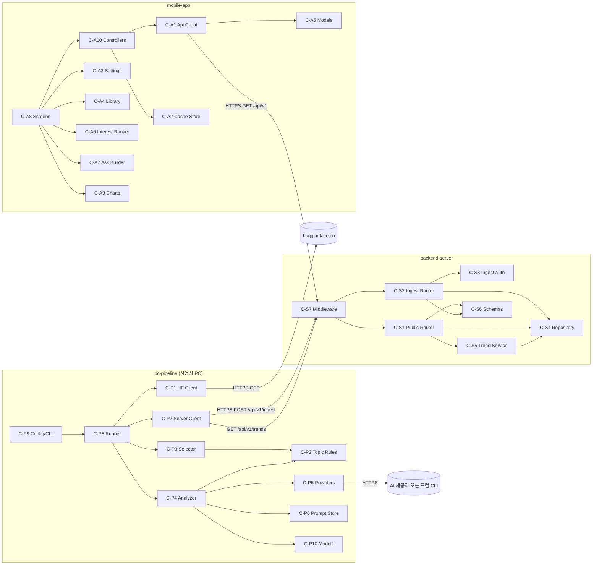

# 컴포넌트 의존 관계 (Component Dependency)

```mermaid
flowchart LR
    subgraph PC["pc-pipeline (사용자 PC)"]
        CLI["C-P9 Config/CLI"] --> RUN["C-P8 Runner"]
        RUN --> HF["C-P1 HF Client"]
        RUN --> SEL["C-P3 Selector"]
        RUN --> AN["C-P4 Analyzer"]
        RUN --> PUB["C-P7 Server Client"]
        SEL --> TOP["C-P2 Topic Rules"]
        AN --> PRV["C-P5 Providers"]
        AN --> PRM["C-P6 Prompt Store"]
        AN --> MOD["C-P10 Models"]
        AN --> TOP
    end
    subgraph SV["backend-server"]
        MW["C-S7 Middleware"] --> PUBR["C-S1 Public Router"]
        MW --> ING["C-S2 Ingest Router"]
        ING --> AUTH["C-S3 Ingest Auth"]
        ING --> REPO["C-S4 Repository"]
        PUBR --> REPO
        PUBR --> TR["C-S5 Trend Service"]
        TR --> REPO
        PUBR --> SCH["C-S6 Schemas"]
        ING --> SCH
    end
    subgraph APP["mobile-app"]
        SCR["C-A8 Screens"] --> CTL["C-A10 Controllers"]
        CTL --> API["C-A1 Api Client"]
        CTL --> CACHE["C-A2 Cache Store"]
        SCR --> SET["C-A3 Settings"]
        SCR --> LIB["C-A4 Library"]
        SCR --> RANK["C-A6 Interest Ranker"]
        SCR --> ASK["C-A7 Ask Builder"]
        SCR --> CH["C-A9 Charts"]
        API --> AM["C-A5 Models"]
    end
    PUB -- "HTTPS POST /api/v1/ingest" --> MW
    PUB -- "GET /api/v1/trends" --> MW
    API -- "HTTPS GET /api/v1" --> MW
    HF -- "HTTPS GET" --> HFAPI[("huggingface.co")]
    PRV -- "HTTPS" --> LLM[("AI 제공자 또는 로컬 CLI")]
```

텍스트 대안: 파이프라인은 Hugging Face 와 AI 제공자를 호출하고 서버의 업로드 API 로 쓴다. 앱은 서버의 공개 API 만 읽는다. 앱과 파이프라인은 서로 직접 통신하지 않는다. 각 unit 안의 의존은 한 방향이며 순환 없음.
